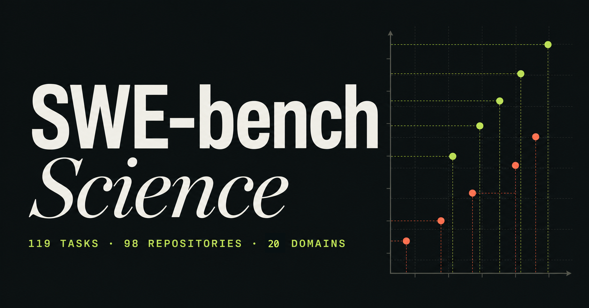
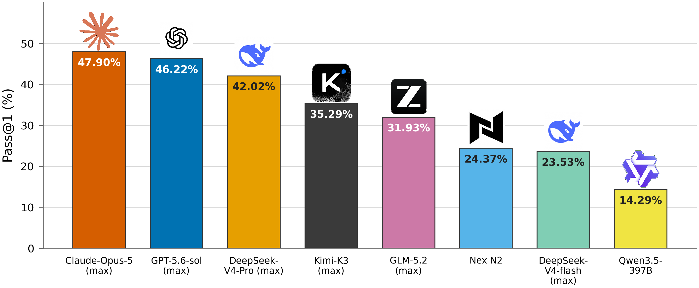
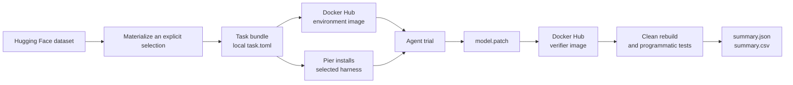

# SWE-bench Science

  <strong>Paper:</strong> <a href="https://arxiv.org/abs/2608.19799">https://arxiv.org/abs/2608.19799</a> 
  <strong>Data:</strong> <a href="https://huggingface.co/datasets/OpenMOSS-Team/SWE-bench-Science">https://huggingface.co/datasets/OpenMOSS-Team/SWE-bench-Science</a> 
  <strong>Leaderboard:</strong> <a href="https://swescience.github.io/">https://swescience.github.io/</a>

Scientific software is full of contracts that ordinary code benchmarks rarely expose:
units, coordinate systems, numerical invariants, file-format semantics, physical
assumptions, and domain-specific workflows. SWE-bench Science measures whether an agent
can change a real repository while preserving those contracts.

  
  
  
  
  
  

  
  
  
  
  

  

Pass@1 comparison of coding agents on SWE-bench Science.

## Start Here

| I want to... | Go to |
| --- | --- |
| Explore the benchmark and leaderboard | [swescience.github.io](https://swescience.github.io/) |
| Browse task metadata and the Dataset Viewer | [SWE-bench Science on Hugging Face](https://huggingface.co/datasets/OpenMOSS-Team/SWE-bench-Science) |
| Download the immutable task images | [Docker Hub image registry](https://hub.docker.com/u/kevinxulearning) |
| Run an evaluation | [Quick Start](#quick-start) |
| Configure a gateway, model, or harness | [Batch runner reference](docs/run-batch.md) |
| Understand the release architecture | [Architecture](docs/architecture.md) |
| Inspect the data contract | [Dataset contract](docs/dataset-contract.md) |

## Why This Benchmark

SWE-bench Science is designed for agents that must do more than produce plausible
source code. Each task is anchored to a real scientific-computing repository and a
fixed baseline. Evaluation checks the resulting change in a clean environment with
programmatic verification.

- **Scientific contracts:** tasks cover numerical behavior, scientific data models,
  file formats, geometry, simulation, imaging, spectroscopy, and more.
- **Repository-level work:** agents navigate existing code, dependencies, tests, and
  build systems rather than solving isolated functions.
- **Reproducible execution:** task selections are explicit, image references are pinned
  by digest, and every run records its configuration.
- **Harness flexibility:** Codex, Claude Code, mini-swe-agent, and other Pier-supported
  harnesses are selected at runtime; they are not copied into every task image.
- **Strict evaluation boundary:** the public release contains no reference-answer patch,
  private verifier tests, credentials, or agent trajectories.

## Release At A Glance

| | |
| --- | --- |
| Tasks | 119 release tasks, numbered `001` through `119` |
| Scientific domains | 20 benchmark-level scientific domains |
| Default selection | 96 tasks without a restricted-license gate |
| Restricted selection | 23 tasks available through explicit opt-in |
| Science-knowledge ablation | 91 tasks marked by `science_knowledge_ablation` in `data/tasks.csv` |
| Runtime images | One environment image and one verifier image per task |
| Image registry | Docker Hub, immutable `linux/amd64` references |
| Evaluation runner | [Pier](https://github.com/datacurve-ai/pier), Harbor-compatible |

The Dataset Viewer exposes `data/tasks.csv` as the `default/test` split. The CSV is the
canonical table; Hugging Face generates its internal preview representation
automatically.

## Architecture

Every task has two published image roles:

| Role | Contains | Published |
| --- | --- | --- |
| Environment | Baseline source, public fixtures, dependencies, compilers, and tools | Docker Hub, pinned by digest |
| Verifier | Clean evaluation environment, held-out tests, and grader | Docker Hub, pinned by digest |

Pier creates the ephemeral agent-enabled environment for a trial. The harness is a
runtime choice, not a third per-task image family. For compiled projects, the verifier
applies the candidate patch to a clean baseline and rebuilds the project before scoring.

## Quick Start

The runtime release is distributed through Hugging Face and Docker Hub. A GitHub clone
is useful for documentation and source inspection, but evaluation runs from the
downloaded dataset bundle.

You need Python 3.11+, Docker Desktop or Docker Engine with `linux/amd64` support,
and `uv` (or another Python environment manager). Apple Silicon hosts are supported
through Docker Desktop's amd64 emulation.

### 1. Install the runner

~~~bash
python3 -m pip install "huggingface_hub[cli]"
uv tool install "datacurve-pier==0.3.0"
docker login
~~~

### 2. Download the release

~~~bash
mkdir swe-bench-science
cd swe-bench-science

hf auth login
hf download OpenMOSS-Team/SWE-bench-Science \
  --repo-type dataset \
  --local-dir .
~~~

### 3. Materialize tasks

~~~bash
# Default selection: 96 unrestricted-license tasks.
python3 tools/materialize.py \
  --output tasks-selected \
  --force

# Or select one task, comma-separated IDs, and inclusive ranges.
python3 tools/materialize.py \
  --task-id 002,005-007 \
  --output tasks-selected-small \
  --force
~~~

The materializer writes `selection.json` with the exact task IDs used for the run.

### 4. Run an infrastructure smoke

This checks task images, Pier wiring, verifier collection, and result paths without a
model call:

~~~bash
python3 tools/run_batch.py \
  --path tasks-selected-small \
  --agent nop \
  --n-concurrent 1 \
  --n-attempts 1 \
  --jobs-dir jobs \
  --job-name smoke
~~~

### 5. Run an agent

~~~bash
python3 tools/run_batch.py \
  --path tasks-selected-small \
  --agent codex \
  --env-file ~/.config/swe-bench-science/codex.env \
  --n-concurrent 2 \
  --n-attempts 1 \
  --jobs-dir jobs \
  --job-name codex-small
~~~

For Claude Code or mini-swe-agent, change `--agent` and provide the corresponding
profile and `--model`. For an approximately 120-second agent-stage smoke, add
`--agent-timeout-multiplier 0.0223`; verifier and native-build timeouts remain
independent.

## Provider Profiles

Keep credentials outside the checkout and image build contexts:

~~~bash
mkdir -p ~/.config/swe-bench-science
cp profiles/codex.env.example ~/.config/swe-bench-science/codex.env
cp profiles/claude.env.example ~/.config/swe-bench-science/claude.env
cp profiles/mini-swe-agent.env.example ~/.config/swe-bench-science/mini-swe-agent.env
chmod 600 ~/.config/swe-bench-science/*.env
~~~

For Codex and OpenAI-compatible gateways, the profile supports:

~~~dotenv
MODEL=gpt-5
OPENAI_API_KEY=replace-with-your-key
CODEX_BASE_URL=https://gateway.example.edu/v1
CODEX_WIRE_API=responses
CODEX_VERSION=latest
CODEX_REASONING_EFFORT=high
~~~

`CODEX_BASE_URL` selects the model gateway. `CODEX_WIRE_API` accepts `responses` or
`chat`. Network proxies are separate and use standard `HTTP_PROXY`, `HTTPS_PROXY`,
and `NO_PROXY` variables. See the [batch runner reference](docs/run-batch.md) for
Claude Code, mini-swe-agent, custom headers, extra agent variables, retries, dry runs,
and the full option table.

## Restricted Licenses

The default materialization excludes tasks that require an explicit license decision.
To include the 23 restricted rows:

~~~bash
python3 tools/materialize.py \
  --allow-restricted-licenses \
  --output tasks-selected-all \
  --force
~~~

The GPL/LGPL/AGPL-family rows are `003, 020, 021, 023, 032, 057, 066, 074, 075, 082,
083, 084, 085, 096, 097, 098, 100, 118`. Other restricted rows are `019`, `026`,
`035`, `101`, and `102`. The gate is named `--allow-restricted-licenses`; there
is no `--allow-GPL` compatibility option.

The 91-task science-knowledge ablation selection is:

~~~bash
python3 tools/materialize.py \
  --task-id 002-082,084,086,090,097-101,111,114 \
  --allow-restricted-licenses \
  --output tasks-science-knowledge-ablation \
  --force
~~~

## Results And Reproducibility

The wrapper records selected task IDs, a selection hash, image references, platform,
Pier version, agent/model settings, and a redacted command in `batch-run.json`.

Evaluation output is written under the chosen jobs directory:

~~~text
jobs/<job-name>/result.json
jobs/<job-name>/summary.json
jobs/<job-name>/summary.csv
jobs/<job-name>/<task>__<trial>/verifier/reward.json
jobs/<job-name>/<task>__<trial>/verifier/ctrf.json
jobs/<job-name>/<task>__<trial>/verifier/test-stdout.txt
~~~

Use `pier view jobs` for trajectories. When diagnosing a result, inspect
`result.json`, `reward.json`, and `test-stdout.txt` together. The summary CSV is the
convenient per-task result table for downstream analysis.

## Data, Licensing, And Attribution

The benchmark release does not include reference-answer patches, credentials, agent
trajectories, or private verifier tests. The project tooling and release metadata use
the repository's [MIT license](LICENSE). Task source, papers, figures, fixtures, and
other third-party materials retain their upstream licenses; audited notices are
included where applicable in [NOTICE.md](NOTICE.md) and the task bundles.

The GitHub repository, Hugging Face dataset, and Docker Hub images are complementary:

- **GitHub** provides the public release documentation, architecture, tooling, and
  audit records.
- **Hugging Face** provides the task table, selections, thin task bundles, and runtime
  tools used to materialize an evaluation.
- **Docker Hub** provides the immutable per-task environment and verifier images.

After download, evaluation uses the local task bundle and Docker Hub digests recorded
in `task.toml`; it does not fetch task definitions from GitHub at runtime.

## Documentation

- [Project website and leaderboard](https://swescience.github.io/)
- [Architecture and runtime model](docs/architecture.md)
- [Batch runner and provider reference](docs/run-batch.md)
- [Dataset and field contract](docs/dataset-contract.md)
- [Release verification checklist](docs/release-checklist.md)
- [Hugging Face dataset card](huggingface/README.md)
- [Material attribution notices](NOTICE.md)

## Contributing And Support

Bug reports, reproducibility issues, and task-quality reports are welcome through
[GitHub Issues](https://github.com/OpenMOSS/SWE-bench-Science/issues). Please include
the task ID, commit or dataset revision, harness/model configuration, platform, and
the relevant redacted summary or verifier output.

For benchmark context, published scores, and the current leaderboard, visit
[swescience.github.io](https://swescience.github.io/).
